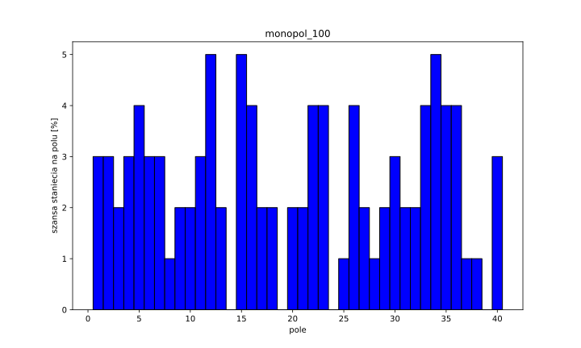
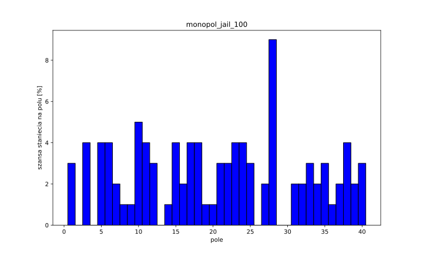
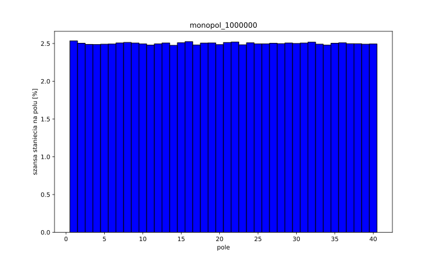
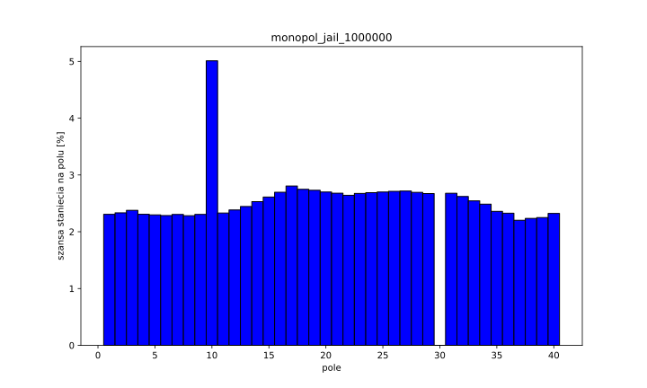
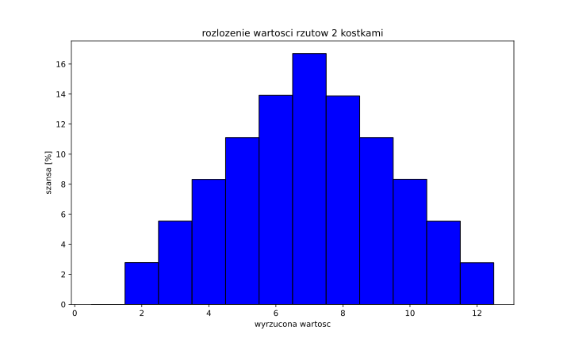

# Lista 0 - Eurobiznes
325572 Tomaszewski Kacper 

## Zadanie do rozwiązania:
Napisz program który modeluje grę w Monopol, jako losowy ruch jednowymiarowy w tablicy cyklicznej 40 elementów, Załóż że gracz rzuca dwiema kostkami i przesuwa się wyznaczoną liczbę oczek. Zbadaj rozkład prawdopodobieństwa odwiedzenia i-tego pola w dwóch przypadkach:  
 a) Ruch po planszy  
 b) Ruch po planszy z uwzględnionym polem więzienia  
 c) co się dzieje zaraz za polem więzienie i idź do więzienia

## Rozkład prawdopodobieństwa dla ruchu po planszy dla 100 rzutów kostkami

Dla 100 rzutów kością liczba danych jest zbyt mała by zbadać rozkłąd prawdopodobieństwa z wystarczająco dużą pewnością. W tym wypadkum zarówno przykład bez jak i ten z uwzględnionym polem pójścia do więzienia, wydają się być całkowicie losowe. 

## Rozkład prawdopodobieństwa dla ruchu po planszy dla 1 000 000 rzutów kostkami
W przypadku 1 000 000 rzutów koscią, mamy wystarczającą ilość danych by zbadać rozkład prawdopodobieństwa.
### Przypadek bez więzienia

W tym przypadku każde pole ma praktycznie równe prawdopodobieństo wystąpienia. Jest to zgodne z założeniami, jako że bez dodatkowych warunków gracz porusza się "w koło" po planszy. Z wystarczająco dużą liczbą ruchów każde pole zostanie odwiedzone taką samą liczbą razy.
### Przypadek z więzieniem

W tym przypadku, widać znaczne odchylenie od normy dla dwóch pól,  
pole #10 - więzienie oraz pole #30 - idź do więzienia

Jako że przez dodatkową zasadę, przy stanięciu na pole #30 gracz idzie do więzienia na polu #10, pole #30 nie zostanie odwiedzone ani razu. Pole #10 zostanie odwiedzone w zamian, przez co jak widać na wykresie, posiada ono praktycznie dwukrotną szansę odwiedzenia przez gracza.

## Co się dzieje zaraz za polem więzienia
Przez pole "idź do więzienia" w porównaniu do modelu bez więzienia, gracz "cofa się" do pola nr 10, dzięki temu ma szansę na odwiedzenie pól 10-30 ponownie zanim przejdzie przez pole #40(start).
 
 Patrząc na rozkład wartości rzutów dwiema kostkami możemy zauważyć podobieństwo z polami zaraz po polu więzienia. Przy rzucie dwiema kostkami nie ma możliwości wyrzucenia jedynki, zaraz po tym wartości 2 do 6 powoli rosną na prawdopodobieństwie. 

 Porównując z rozkładem prawdopodobieństw dla pól po których porusza się gracz, pole bezpośrednio za więzieniem jest porównywalne z tym zaraz przed więzieniem, jako że nie można wyrzucić wartości "1" jest to zgodne z przewidywaniami. Kolejne wartości pól zwiększają swoje prawdopodobieństwa aż do pola "17", czyli 7 pól za polem więzienia, porównywalnie z najczęściej występującą wartością w przypadku rzutów kostkami. 

 Analogicznie za polem "idź do więzienia" możemy zauważyć podobny przypadek, tym razem jednak szanse stanięcia na polu maleją, od pola 30 do pola 38. Po czym szanse stanięcia na polu "stabilizują się"

Wieksze szansę stanięcia na polach zaraz za polem Więzienia oraz polem "idź do więzienia" wynikają z pętli którą powoduje pole #30 przenosząc gracza na pole #10 