# Lista 1 - Plamy
325572 Tomaszewski Kacper 

## Zadanie do rozwiązania:
Implementacja i przedstawienie modelu "plam"

## Implementacja
Implementacja modelu "Plam" wygląda zasadniczo jak implementacja "Gry w życie", z różnicą na jakiej zasadzie obliczany jest następny krok w symulacji

1)  Tablica pól która będzie zawierała status pola (żywa / martwa) wypełniona losowo
2)  Funkcja "następny krok" aktualizująca tablice pól przy następujących warunkach:

    1) Jeśli suma żywych sąsiadów wynosi [1, 2, 3, 5] : pole = martwe
    2) Jeśli suma żywych sąsiadów wynosi [4, 6, 7, 8, 9] : pole = żywe
3)  W tej implementacji nie zliczam komórek poza "brzegami" tablicy / uznaję je jako martwe

## Przedstawienie modelu
Poniżej animacja modelu plam:

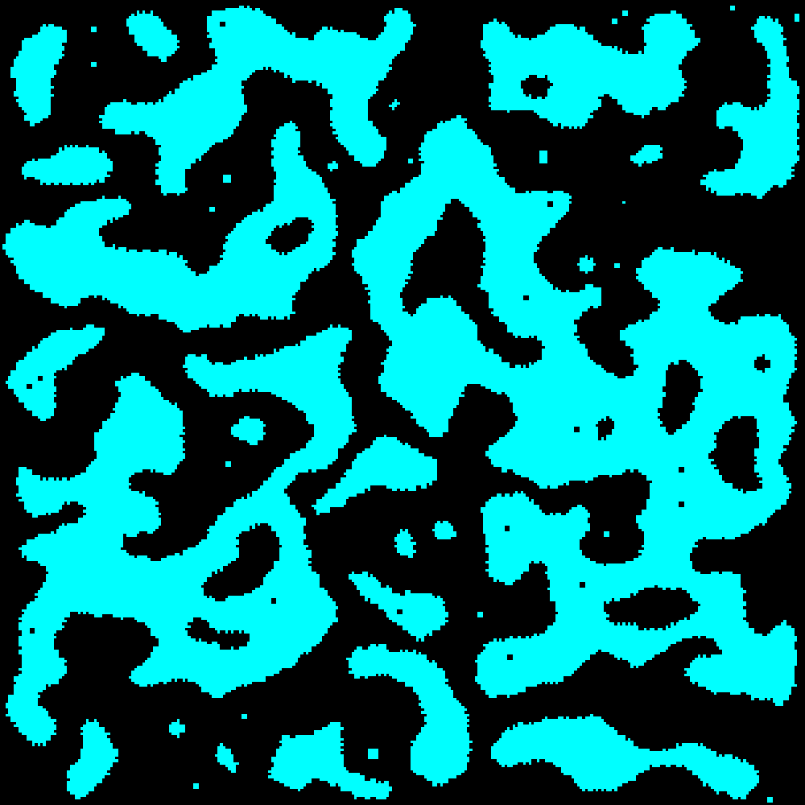

rozmiar tablicy: 300x300,
liczba kroków: ~13 000,
klatka animacji co 100 kroków

Z animacji można zaobserwować:

1)  losowo ustalone komórki w kilku pierwszych krokach łączą się w klastry / plamy
2)  plamy są niestabilne i powoli "umierają"
3)  istnieje kilka małych stabilnych plam

## Grafy
Każdy graf został zrobiony dla innych losowych wartości początkowych,

Oś X : liczba iteracji (kroków)
| Oś Y : gęstość żywych komórek  

Grafy gęstości dla modelu 100x100

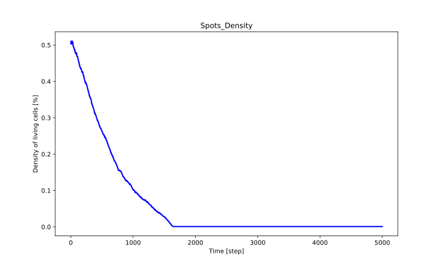
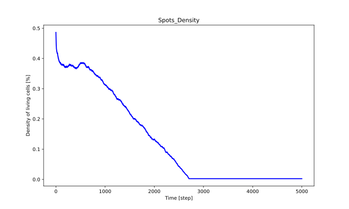
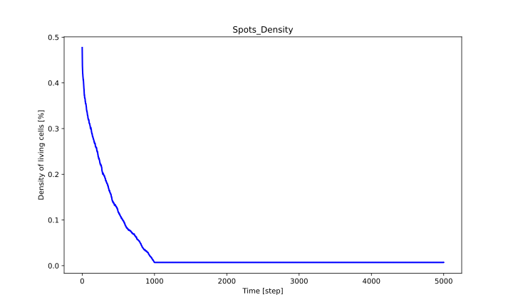

Grafy gęstości dla modelu 300x300

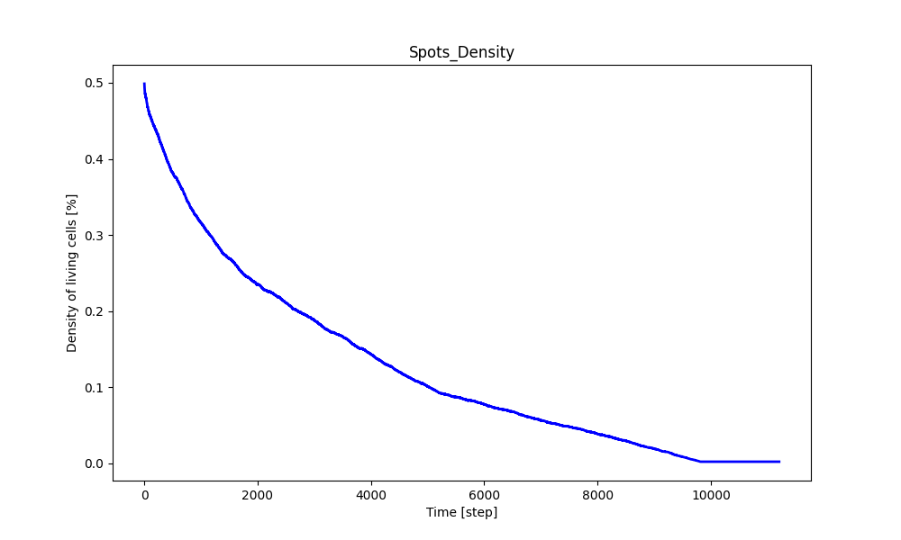
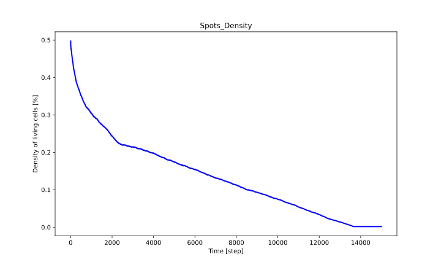
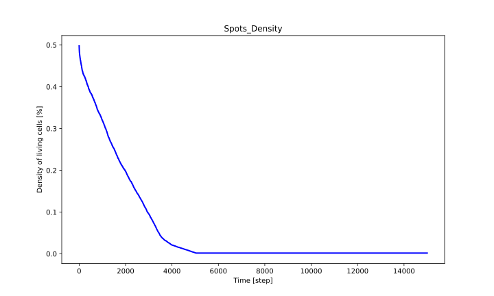

Porównując grafy do wcześniejszej animacji możemy zauważyć podobieństwo,
w pierwszym kroku, jako że wartości początkowe pól są losowe, gęstość komórek żywych w porównaniu do całkowitej liczby pól wynosi w przybliżeniu 50%,
następnie gęstość powoli spada aż stabilizuje się w okolicy zera

## Obserwacje
1)  Istnieje ograniczona liczba stabilnych stanów komórek, poniżej kilka przykładów:

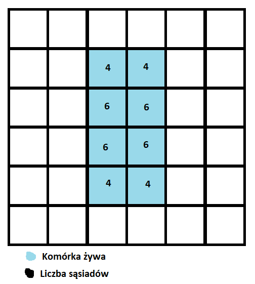
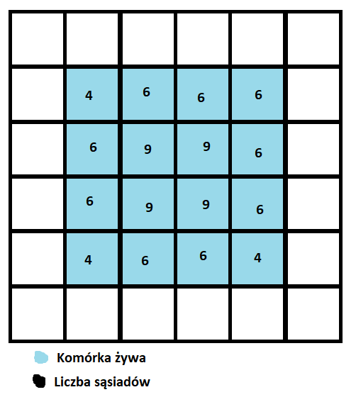
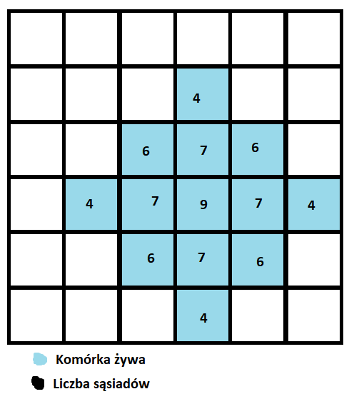

Przez warunek "komórka umiera gdy liczba sąsiadów = 5" liczba miejsc gdzie można dodać komórkę bez stworzenia niestabilnego układu jest bardzo ograniczona, jako że komórki z czterema sąsiadami praktycznie zawsze znajdziemy na brzegu "plamy"

1)  Im więcej komórek w "plamie" tym trudniej jest utrzymać jej stabilność, 

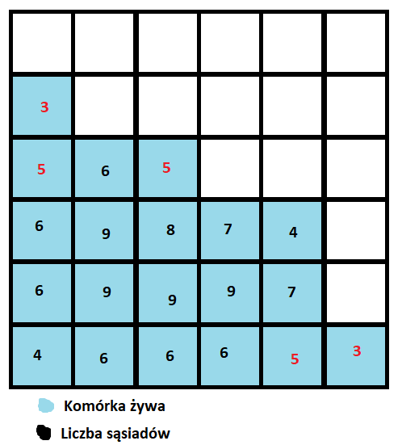

Przez losowość warunków początkowych oraz nieregularność kształtów plam, szansa na "duże" stabilne plamy jest bardzo mała, dlatego wszystkie duże plamy powoli "umierają" a graf gęstości żywych komórek zbliża się do zera